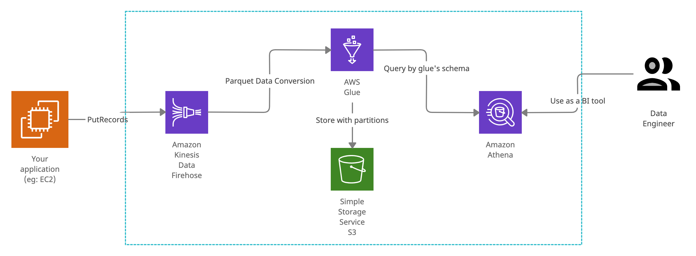

# Demonstrate streaming and analyzing log data by using AWS solution
## The architecture
Here is a diagram describle the architecture of the streaming and analyzing log data by using AWS Solution.


As you can see, we use 4 aws services
- `Amazon Kinesis Data Firehose`
  - Streaming log data from application to S3, using the schema defined by AWS Glue.
  - Buffering incomming data by size and the duration of data is in Firehose.
- `AWS Glue`
  - Define schema which should be the output to S3.
  - Define parquet file output (columnar format).
  - Define partition of the output, which Amazon Athena will reference when querying.
- `Amazon S3`
  - Store the parquet data which received from the Kinesis Firehose
- `Amazon Athena`
  - Using AWS Glue's schema to query data from S3 directly.

## Pricing
One of the most importance when considering an architecture is the pricing. No matter how cool the technical is, if the cost is too expensive it mean nothing.

Because of this solution is serverless, we can't calculate exactly the cost but let's me show you the estimate cost.

Let's suppose we have `1000 records of streaming data per second` sent to Firehose in `8 hours a day (28,800 seconds)`. Each record has `5KB in size`. Here is a simple cost simulator.

- Amazon Kinesis Data Firehose
  - Data ingested = (1,000 record/sec * 5 KB/record) = 0.004768 GB/sec
  - Data ingested (GB per month) = 30 days/month * 28,800 sec/day * 0.004768 GB/sec = 4119.552 GB/month
  - Currently the price in ap-northeast-1 per FB of Data ingested is
    - `$0.031` of first 500 TB/month
    - `$0.025` of next 1.5 PB/month
  - -> month charges = $0.031 * 4119.552 = `$127.7`
- AWS Glue
  - Because we use Kinesis Firehose for buffering incomming data, we can setup the outcomming duration is upto 300 seconds, which mean only one object will be stored by AWS Glue per 300 seconds.
  - Number of object stored = (8 hours/day * 60 minutes ÷ 6 minutes/object) * 30 days/month = `2,400 objects` -> It's free since it's not over the 1M object. yeah :)
  - Number of requests = number of object in this case. It's also free charge.
- Amazon S3
  - As we calculate storage per month above, we will store 4119.552 GB/month but this is the volume before compress. We store data in parquet format, which is compressed format. Suppose that parquet format will compess roughly 70% for origin volume, then the actually storage is 0.7 * 4119.552 = `2883.68 GB/month`.
  - Storage charges = 2883.68 GB/month * $0.025 = `$72`
- Amazon Athena
  - We will be charged only when the queries scan data. By adding partitions and supporting columnar format (parquet), I guess the cost of query is not too much!

Total cost is: $127.7 + $72 = `$199.9`.

## About the CDK project
I have wrote code to build the architecture by using AWS CDK.

The `cdk.json` file tells the CDK Toolkit how to execute your app.

### Getting started
Make sure that you have already been setup the `aws cli` alongs with access key and secret key. If you don't, please take a look at [Getting started with AWS CDK](https://docs.aws.amazon.com/cdk/latest/guide/getting_started.html).

After the `aws cli` has already been setup, then clone this repo, and setup neccesary env.

```bash
cp .env.example .env
```

Reflect the environment variables to you local environemnt.

Then, run `cdk deploy` to deploy your code to build aws services. You can see the progress on `AWS CloudFormation`'s console.

#### Let's send logs to Firehose
I also wrote a golang snippet to send fake logs to AWS Kinesis Data Firehose, by using the `PutRecords` API.

Make sure you have installed golang on your PC. :)
```bash
cd tools

# Setup AWS Region
cp .env.example .env

# Send 10 logs once
go run main.go
```

### Useful commands

 * `npm run build`   compile typescript to js
 * `npm run watch`   watch for changes and compile
 * `npm run test`    perform the jest unit tests
 * `cdk deploy`      deploy this stack to your default AWS account/region
 * `cdk diff`        compare deployed stack with current state
 * `cdk synth`       emits the synthesized CloudFormation template
 * `cdk destroy`     destroy the infra you have been created

### Do you feel tired when removing the S3 Bucket if the CDK has failed?
If CDK has failed, the CDK will take care of rollback process. Since, AWS S3 is object storage, it's dangerous to being deleted. So, CDK does't delete created buckets, and when we redeploy it, `the buckets alreadt exits` error will occur. To resolve this problem, we need to delete created S3 buckets manually.

Don't worry, I have wrote a snippet to delete these buckets. However, please be careful when using this even it only delete empty bucket. :)
```bash
cd tools
sh clearbuckets.sh
```